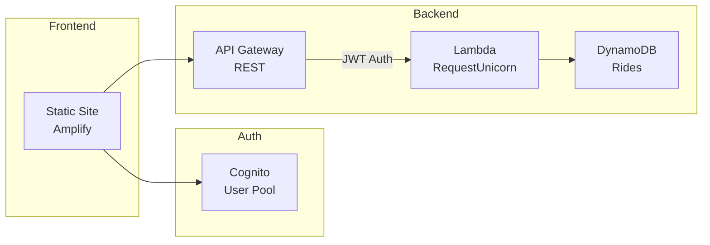

# Wild Rydes Serverless Infrastructure

AWS serverless backend for Wild Rydes unicorn ride-sharing application.

## Architecture



## Structure

```
.
├── environments/
│   └── dev/               # Development environment
├── modules/
│   ├── api-gateway/       # REST API + CORS
│   ├── cognito/           # User Pool + Client
│   ├── dynamodb/          # Rides table
│   ├── iam/               # Lambda execution role
│   └── lambda/            # RequestUnicorn function
└── static-site/           # Frontend (for Amplify deployment)
```

## Deployment

```bash
cd environments/dev
terraform init
terraform plan
terraform apply
```

## Outputs

| Output | Description |
|--------|-------------|
| `api_invoke_url` | API Gateway endpoint |
| `cognito_user_pool_id` | User Pool ID |
| `cognito_client_id` | App Client ID |

## Frontend Config

Update `static-site/js/config.js` with Terraform outputs:

```js
window._config = {
    cognito: {
        userPoolId: '<cognito_user_pool_id>',
        userPoolClientId: '<cognito_client_id>',
        region: 'us-east-1'
    },
    api: {
        invokeUrl: '<api_invoke_url>'
    }
};
```

## Modules

| Module | Description |
|--------|-------------|
| [cognito](modules/cognito/) | User Pool + SPA Client |
| [dynamodb](modules/dynamodb/) | Rides table (PAY_PER_REQUEST) |
| [iam](modules/iam/) | Lambda execution role |
| [lambda](modules/lambda/) | RequestUnicorn function |
| [api-gateway](modules/api-gateway/) | REST API + Cognito authorizer |
